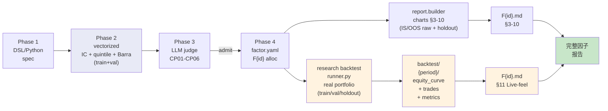
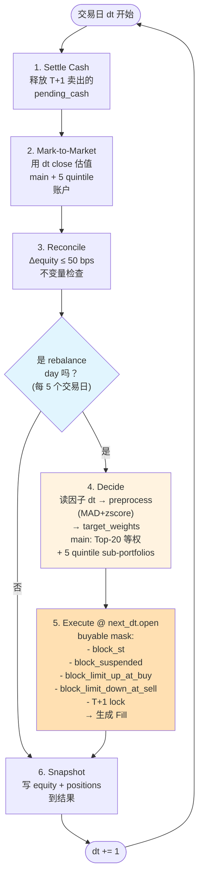
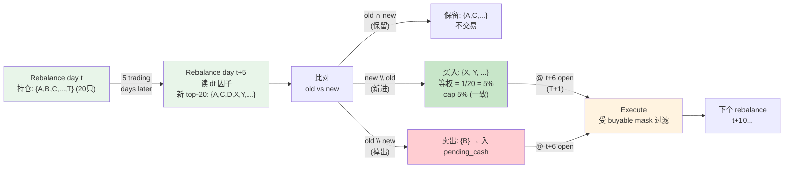

# 回测流程图（3 张）

数据源：`src/research/backtest/{runner,engine,strategy,executor,calendar,filters}.py`。

---

## 1. 端到端数据流 — Phase 1 设计 → Phase 4 回测 → Report 出图

> 一个因子从被设计到产出回测报告的全链路。Phase 2/3 用裸 quintile 信号判定 admit；Phase 4 admit 后才进 backtest 引擎做真实组合层模拟。



**关键分工**：
- **§3-10**（蓝色路径）= 零成本毛信号评测（rank IC / quintile / L/S spread / Barra residual）
- **§11**（橙色路径）= 真实组合回测（Top-20 等权 / hfq 价 / T+1 / 涨跌停拦截 / 成本）

---

## 2. 引擎日循环 — 每个交易日 6 步状态机

> `src/research/backtest/engine.py` 主循环。Information-set invariant：决策时点 `dt` 只能看到 ≤ `dt.close` 的数据；执行用 `next_dt.open` 价格。



**实测节奏（csi1000 holdout 2024）**：
- 每个 period 约 242 个 trading days
- 其中约 **48 个 rebalance days**（242 / 5）
- 其余 ~194 天只走 settle/MTM/reconcile/snapshot 4 步，**不交易**

---

## 3. 持仓轮换时间线 — 每个 rebalance day 的换仓决策

> Top-K 策略不是"持有 N 天就卖"，而是"持有直到掉出 top-20"。轮换由因子排序驱动。



**实测换手（F029, 旧 config N=50/10M）**:
- 每个 rebalance day 平均 **74.19 笔交易** = ~37 买 + ~37 卖
- 50 持仓中每周轮换 37 只（74% 换手）
- 平均持仓 = 50/37 × 5d ≈ **6.7 trading days**（约 1.3 周）
- 年化 turnover_x = 17.69x（一年成交额 = 起始资本的 17.69 倍）

**新 config 预期（N=20/1M）**：N 缩了，但 turnover_pct 应该类似（取决于因子 signal 的 ranking 稳定性）。一笔交易金额从 ~6.8 万降到 ~1.7 万，slippage assumption 更保守。

---

## 4. 配置参数速查（current default）

```yaml
backtest.defaults:
  universe: csi1000
  initial_capital: 1000000        # 1M (was 10M, 2026-05-16)
  rebalance:
    freq_days: 5                  # 周频
    anchor: monday
  portfolio:
    holdings_n: 20                # Top-20 (was 50, 2026-05-16)
    weight_scheme: equal
    max_single_weight: 0.05
  matching:
    match_price: open             # T+1 next-day open
    price_adjust: hfq             # 后复权（但因子值目前用 qfq cache, 见 doc caveat）
  cost:
    commission_bps: 3             # 双边
    slippage_bps: 5               # 双边
    stamp_schedule:               # 卖出印花税
      - 2015-01-01 ~ 2023-08-27: 10 bps
      - 2023-08-28+: 5 bps
  filters:
    block_st: true
    block_suspended: true
    block_limit_up_at_buy: true
    block_limit_down_at_sell: true
    cooldown_days_after_unsuspend: 1
    newly_listed_days: 60
    stale_position_days_max: 5
```

**期内成本预算**（粗算）：
- 双边交易成本 = 印花 5 + 佣金 3×2 + 滑点 5×2 = **21 bps**
- 年化换手 17.69x → 成本拖累 ≈ 17.69 × 21 = **~370 bps/year**
- 需要因子毛 L/S spread > 4-5% 才能在 long-only Top-20 上扣完成本剩正
